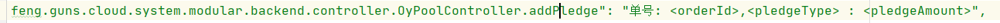
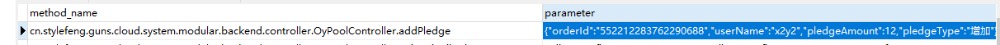
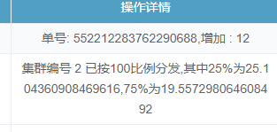

# my_log_framework
操作记录的框架

每个controller执行不同的操作，需要记录下来，等前端查询操作记录，给前端展示

例如修改用户接口，把用户xxx的邮箱改成了xxx

例如修改订单时间接口，把订单的开始时间改成了xxx

通过情况下，在切点表达式找到这些controller然后再切面对他们做增强，为了记录不同的上述操作描述，需要通过反射拿到controller，识别controller，然后使用if else 或者switch 判断使用的哪个controller然后把参数拼接成想要表示的，完整的描述记录在数据库。

例如

```java
   
        //pausePoolOrder方法的参数pauseFlag = true表示开始订单 ，false表示暂停订单
        if ("pausePoolOrder".equals(controllerMethod.getName())){
            Boolean pauseFlag = (Boolean)joinpoint.getArgs()[1];
            if (pauseFlag) {
                desc = "开始" + desc;
            }else {
                desc = "暂停" + desc;
            }
        }else if("xxxxxxx".equals(controllerMethod.getName())) {
        	desc = "xxx"
        }
        }else if("xxxxxxx".equals(controllerMethod.getName())) {
        	desc = "xxx"
        }
        return desc;

```

数据库记录   

但这代码太过于冗余和臃肿，不能很好的维护，没有通用性，个个controller没有解耦，全部聚集在一坨。


## 改进：

数据库不存描述了，存json参数，即前端的请求例如修改用户密码{username=lhz,password = 123},而我只需要在配置文件中，以k-v的形式，k为controller的全限定名，v为这个controller通的的描述，其中重要的以占位符替带例如修改用户密码的接口需要配置 k =com.xx.setPass v =修改了用户#{name},的密码为#{password}.

数据库保存的主要内容

cn.stylefeng.guns.cloud.system.modular.backend.controller.OyPoolController.updatePoolPrice

{"packageId":"2","type":"USDT","price":744}

配置文件的配置内容

key -v 描述

```
"cn.stylefeng.guns.cloud.system.modular.backend.controller.OyPoolController.updatePoolPrice": "套餐id#{packageId},#{type}类型,成本价格修改为#{price}",
```

为此模仿mybatis的mappedstatement k 为方法的全限定名 v为一个方法对象，这个对象，自定义的，里面的变量，主要包含method 和 string ，在spring上下文启动的时候会去扫描controller构建这样的一个map，


切面要做的就是把参数变成json参数保存在数据库，记录方法名，然后前端查询操作记录的时候，从数据库返回一条记录，包含方法名和json参数，有了方法名可以找到通用的描述，用了json可以替换掉通过描述的关键字，祖成完整的一条操作内容。

我的项目里面的配置:

```xml
"cn.stylefeng.guns.cloud.system.modular.backend.controller.OyPoolController.addPledge": "单号: <orderId>,<pledgeType> : <pledgeAmount>",
```



我的数据库保存的记录

{"orderId":"552212283762290688","userName":"x2y2","pledgeAmount":12,"pledgeType":"增加"}	



后台页面实际的内容  :单号: 552212283762290688,增加 : 12




用户购买算力，每日发奖励流程

用户属于集群

-------------------------------

 集群25%直接发放，75%180天释放（按照比例分个个给用户）

1.先从链上，通过rpc，拿到这些数据，用一个log表保存今天集群的这两个内容

例如  id 100  now

----------------------------------------------------------

遍历每个人，算出每个人的权重，存入每日奖励表(everyday table)

a 10 now  --  now+180

b 90 now -- now+180

--------------

先算出180天内的总共的,从everyday table

线性释放start< today < ned    v1   v1*75%/180

立即释放 start = today v2                 v2*25%

存入reward table

------------------------

审核

------------------

提现  我们钱包打向用户钱包

​		


